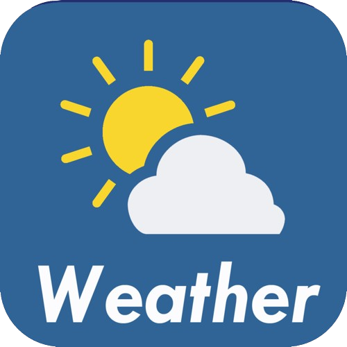

<div align="center">



# Weather App - WAPP

</div>

This project was created with goal of giving weather statics for anyone. You can search for a city or country and know how's the weather there.

Api Owner/Colaborator: [OpenWeather](https://openweathermap.org/)

### Preview
<div align="center">
  Home Page
  

  Seeing Luanda weather
  

  Not found page
  
</div>


### Tools 🛠️
- Python
- Django
- HTML5/CSS3

### Contributing 🫂
To contrib create a fork, make your changes and after send me a pull request!

### How to run?🏃
```bash
    # In your git bash, clone the repo.
    git clone https://github.com/angelo-francisco/WAPP-WeatherAPP.git

    # Activate the enviroment
    ./venv/Scripts/Activate.ps1

    # Go to the source
    cd src

    # run the project
    python manage.py runserver
```


### License 🔑

The license of the project is [MIT](https://opensource.org/license/mit)
